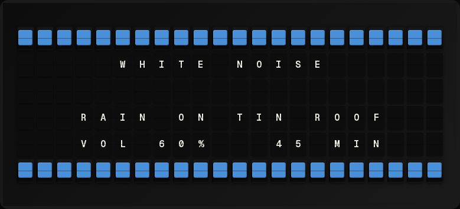

# White Noise Plugin

A gentle rain / white noise mode for FiestaBoard. It shows softly cascading
white (or blue/violet) tiles that drift down the board with only a few
changing at a time — creating a quiet, soothing pitter-patter on the
physical Vestaboard.

## Preview

### Light Intensity (Default)

*Gentle drizzle with 3 drops per frame*

### Medium Intensity

*Moderate rain with 6 drops per frame*

### Heavy Intensity

*Steady rain with 10 drops per frame*

### Color Options
| White (default) | Blue | Violet |
|----------------|------|--------|
|  |  |  |

## How It Works

Each refresh cycle the plugin:

1. **Moves** existing raindrops down by one row.
2. **Removes** drops that have fallen off the bottom of the board.
3. **Spawns** a small number of new drops along the top row at random
   columns.

Because only a handful of tiles flip between frames, the board produces a
gentle "light rain" sound instead of an overwhelming clatter.

## Settings

| Setting           | Default  | Description                                                    |
| ----------------- | -------- | -------------------------------------------------------------- |
| `intensity`       | `light`  | `light` (3 drops), `medium` (6), `heavy` (10), or `custom`     |
| `drop_color`      | `white`  | Tile colour for drops: `white`, `blue`, `violet`               |
| `drops_per_frame` | `3`      | New drops per frame (1-22, only used with `custom` intensity)  |
| `max_drops`       | `30`     | Max simultaneous drops on board (1-132)                        |

## Variables

| Variable          | Description                                    |
| ----------------- | ---------------------------------------------- |
| `white_noise`     | The full 6×22 board string with colour markers |
| `intensity`       | Current intensity setting                      |
| `drop_color`      | Current drop colour setting                    |
| `active_drops`    | Number of raindrops currently on the board     |
| `drops_per_frame` | Drops spawned per frame                        |
| `max_drops`       | Maximum simultaneous drops allowed             |

## Tips

- Use the **light** intensity for a relaxing ambient effect. It changes
  only 3 tiles per cycle, keeping the sound minimal.
- Pair with a slow refresh interval (the default page rotation) so each
  frame lingers before the next gentle shift.
- For experimentation, use **custom** intensity with `drops_per_frame` to
  find your ideal rain density.
- Adjust `max_drops` to control overall board density. Lower values (10-20)
  keep it sparse, higher values (40-60) create a denser rain effect.

## Setup & Configuration

- **[Setup Guide](./docs/SETUP.md)** - Installation and configuration (includes advanced tuning tips)
